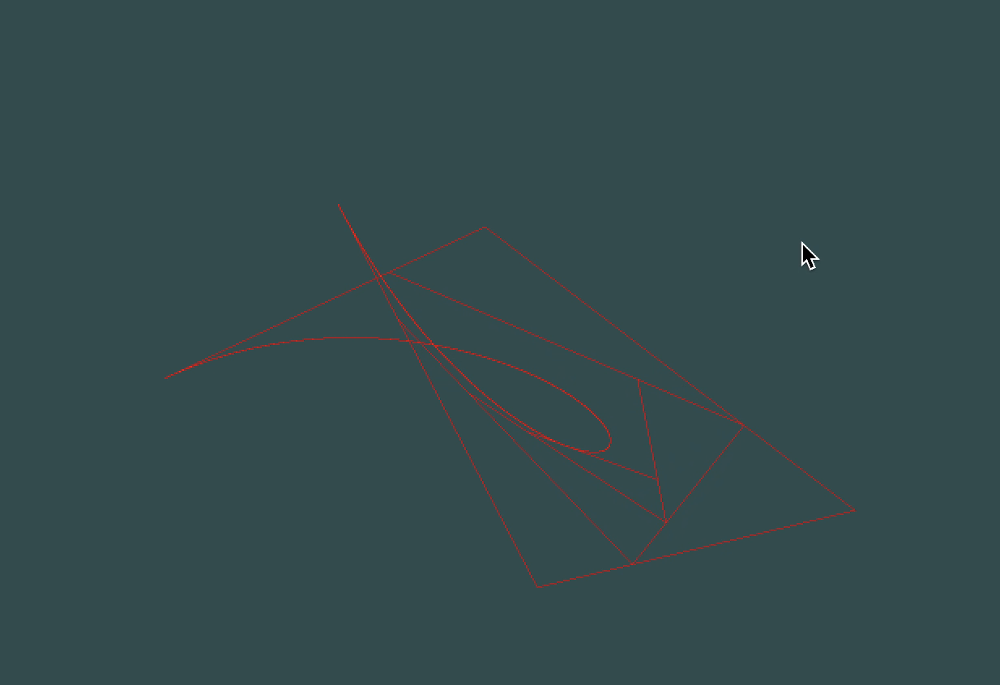
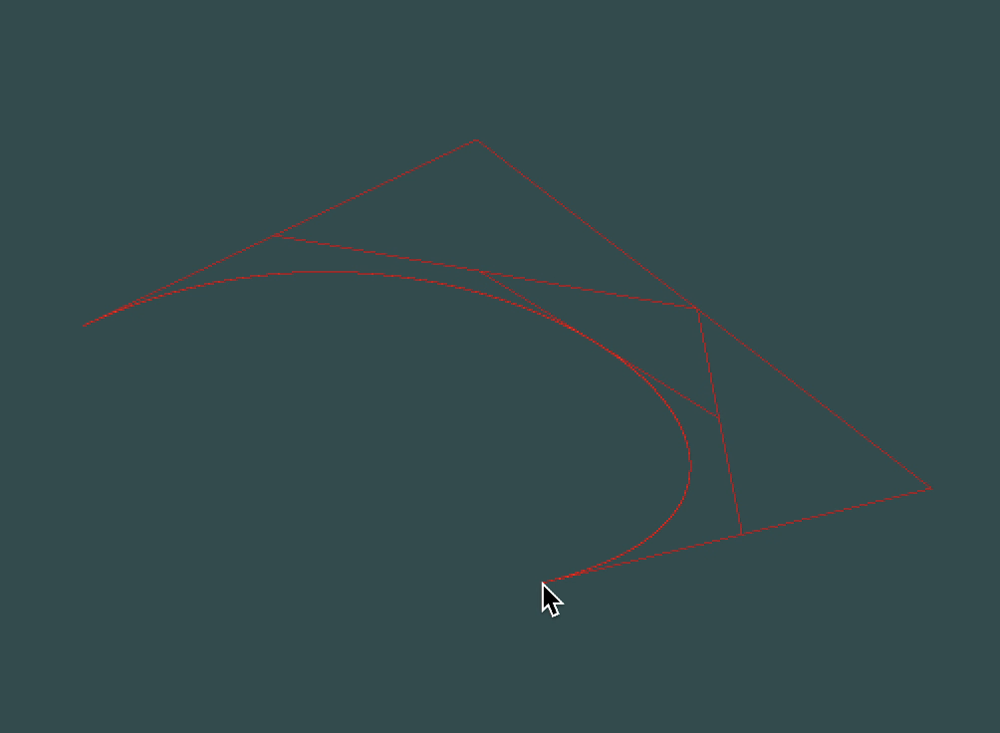

# 计算机图形学第八次作业

```
姓名：刘俊峰
学号：16340150
```

## 要求

### Basic:
1. 用户能通过左键点击添加Bezier曲线的控制点，右键点击则对当前添加的最后一个控制点进行消除 
2. 工具根据鼠标绘制的控制点实时更新Bezier曲线。

Hint: 大家可查询捕捉mouse移动和点击的函数方法 

### Bonus:
1. 可以动态地呈现Bezier曲线的生成过程。

## 实验步骤
### 实现bezier曲线算法
```cpp
vector<pair<float, float>> resultPoints;

	int n = points.size() - 1;
	for (double t = 0; t <= 1; t += 0.00005) {
		pair<float, float> targetPoint;
		for (int i = 0; i <= n; i++) {
			double B = bernstein(i, n, t);
			pair<float, float> curPoint = points[i];
			targetPoint.first += curPoint.first * B;
			targetPoint.second += curPoint.second * B;
		}
		resultPoints.push_back(targetPoint);
	}
	return resultPoints;
```
这里步长为0.0005，动态计算出bezier曲线的每个点的坐标，根据这些坐标，我们就可以用gl_points图元将他们画出。

### 鼠标点击事件
```cpp
if (button == GLFW_MOUSE_BUTTON_RIGHT && action == GLFW_PRESS) {
	...
}
else if (button == GLFW_MOUSE_BUTTON_LEFT && action == GLFW_PRESS) {
		double tempX = 0, tempY = 0;
		glfwGetCursorPos(window, &tempX, &tempY);
		...
```
这里用到的是glfw的鼠标左右键按压事件，并用glfwGetCursorPos找到鼠标的位置。

### Bonus: 动态呈现bezier曲线绘制过程
利用插值的方法，递归画出不同层的折线段。
```cpp
	const double t = dynamicT;
  vector<pair<float, float> > prePoints(ctrlPoints);
  while (prePoints.size() != 0) {
    vector<pair<float, float> > tmp(prePoints);
    prePoints.clear();
    for (int j = 0; j < tmp.size() - 1; ++j) {
      pair<float, float> p;
      auto fir = tmp[j];
      auto sec = tmp[j + 1];
      p.first = t * sec.first + (1 - t) * fir.first;
      p.second = t * sec.second + (1 - t) * fir.second;
      prePoints.push_back(p);
    }
    for (int j = 0; prePoints.size() >= 1 &&  j < prePoints.size() - 1; j++) {
      drawLine(shader, prePoints[j], prePoints[j + 1]);
    }
  }
  if (dynamicT + 0.005 > 1) {
		dynamicT = 1;
  }
	else {
		dynamicT += 0.005;
    // cout << dynamicT << endl;
  }
```
最内层循环就是核心的插值算法，找出它内层线段的端点位置，并画出来。直到无法找到两个端点为止。

## 实验截图


